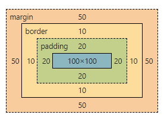
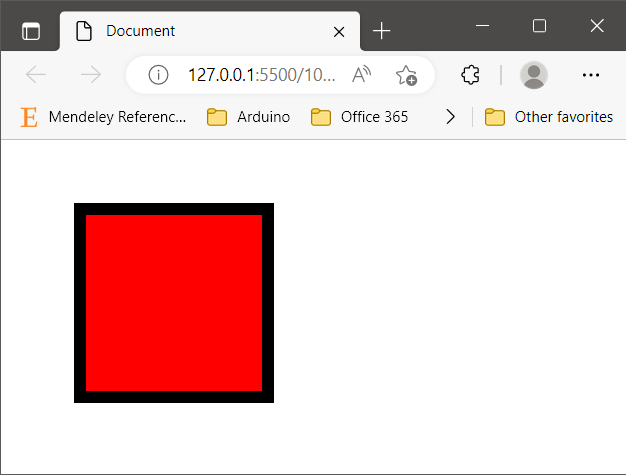
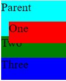
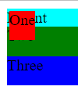
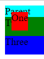
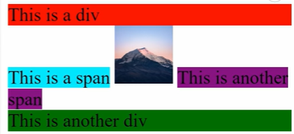
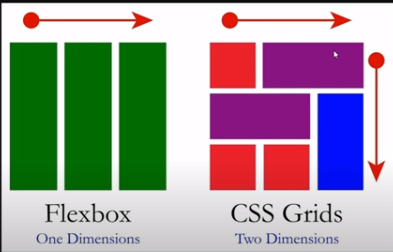

# CSS Tutorial

## Syntax

```css
selector {
    property1: value;
    property2: value;
}
```

## CSS Selectros

There are mainly 3 selectors. `element`, `class` and `id` a `class`. These are in following priority.

```
element < class < id < inline-style
```

### Element selectors

for example `h1` `span` `div` `btn` and many more

```css
element {
    property1: value;
    property2: value;
}
```

### Class selectors

Say our html dom looks something like

```html
<h1 class="big-header">Title</h1>
```

Syntax of Class selector is

```css
.className {
    property1: value;
    property2: value;
}
```

### Id selectors

HTML element can only have one id but many classes. Say our html dom looks something like

```html
<h1 id="big-header">Title</h1>
```

Syntax of Class selector is

```css
#idName {
    property1: value;
    property2: value;
}
```

### Hybrid selector

Multiple selector type may also be merged together for specific style. There should be no empty space inbetween in that case.

```css
h1.className#idName {
    property1: value;
    property2: value;
}
```

### Ancestor child selector

Say you only want to style those paragraph elements that are inside a div in that case you can insert a white space between ancestor and child. such as

```css
ancestor-selector child-selector {
    prop: value;
}
/* For example*/
div p {
    color: red;
}
```

### Selectors for sharing style

If you want to have two or more elements to share some style you can achieve so by inserting a comma(,) among selectors.

```css
.selector1,
.selector2 {
    prop: red;
}
```

## How to define external css file

The best way to link css with html is to reference the external file.

```html
<head>
    <link rel="stylesheet" href="style.css" />
</head>
```

## Some quick tips for css properties

### `color` to change text color.

### `Box` model

Understanding this box model is very necessary.



Can you guess the output of following css style.

```
.box{
    height: 100px;
    width: 100px;
    padding: 20px;
    margin: 50px;
    border: 10px solid black;
    background-color: red;
}
```



### Different units

#### `px`

pixels

#### `%`

percentage of width and height.

#### `em`

For font related application. if font size is say 16px then 1em=16px

#### `rem`

Similar to `em`. `em` scale with the font size for parent element whereas `rem` scales with the font size of root.

### Position

https://youtu.be/jx5jmI0UlXU

#### `static`

By default position is `static`.

#### `relative`

This allows us to position the element relative to where it would normally be if the position is `static`. As given example

```css
.child-one {
    height: 30px;
    background-color: red;
    position: relative;
    left: 10px;
    top: 10px;
}
/* child-two and child-three have static position*/
```



Look how it overflowed the child-two. So position relative is not used generally with top left right bottom.

#### `absolute`

Treat the element such that it is bind to no one. Feels like it does not even existed.

-   It can be used to stick something and do not want to move it around.
-   By default it will feel that it is relative to top left of screen.
-   But if it has a parent component that it can reference then the position will be relative to that.

-   example1: In this case the position will be relative to top left of screen. because by default parent is `static`. so it's child element can't reference to it.

```css
.parent {
    background-color: aqua;
}

.child-one {
    height: 30px;
    background-color: red;
    position: absolute;
    top: 10px;
    left: 10px;
}
```



-   example2: If we change the position type of parent then the child-1 will adjust relative to it.

```css
.parent {
    background-color: aqua;
    position: relative;
}

.child-one {
    height: 30px;
    background-color: red;
    position: absolute;
    top: 10px;
    left: 10px;
}
```



#### `fixed` position

The element stay in the same position even if we scroll. But `absolute` does not work this way.

#### `sticky` position

By default it is `relative` but when we scroll and the element start going out of sight it just stick there to be in the view.

### Display properties



#### `block`

Cover 100% of available width. Nothing else on the same line.

```css
div {
    display: block; /*This is default for div*/
}
```

#### `inline`

These element will take the least amount of space possible. `<span>` have this property by default.

```css
span {
    display: inline; /*This is default for span*/
}
```

-   You can't assign width and height to these elements.

#### `inline-block`

Same as `inline` except that you can assign width and height to these.

#### `none`

Work like element is removed from the document.

#### `grid` and `flexbox`



This is the most important css display property. easiest way to get started with
CSS `grid` is to compare it to what its most similar to which is `flexbox`. So
flexbox essentially is just a way to layout things in one dimension so that they're
flexible and they can change their size dynamically based on the content inside of
the flexbox container grid is exactly the same and that it allows you to lay out
items flexibly inside of the container but it allows you to do it not in just one
dimension but in two dimensions.

-   A `container` is the object that wraps all of your different grid items.

-   Inside of that grid container we have different `grid items`.

-   In the picture the container is the square that wraps all the different objects.
-   We then have `grid-gaps` between `grid-items`.
-   `Rib-tracks` are dividers between all of our different rows and columns that our grid is composed of.

Now we can start

```css

```

